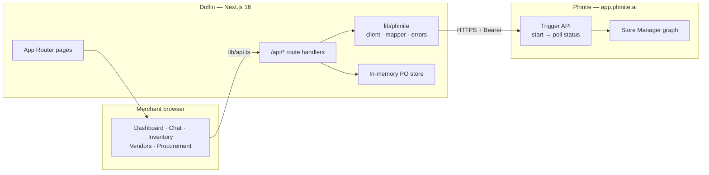
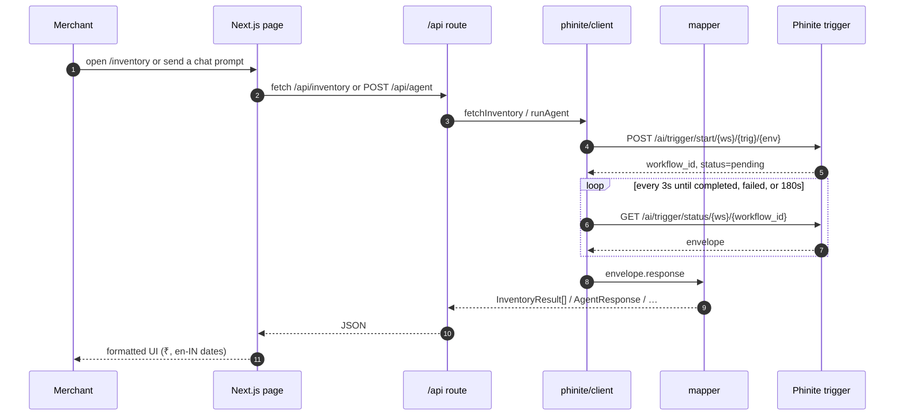
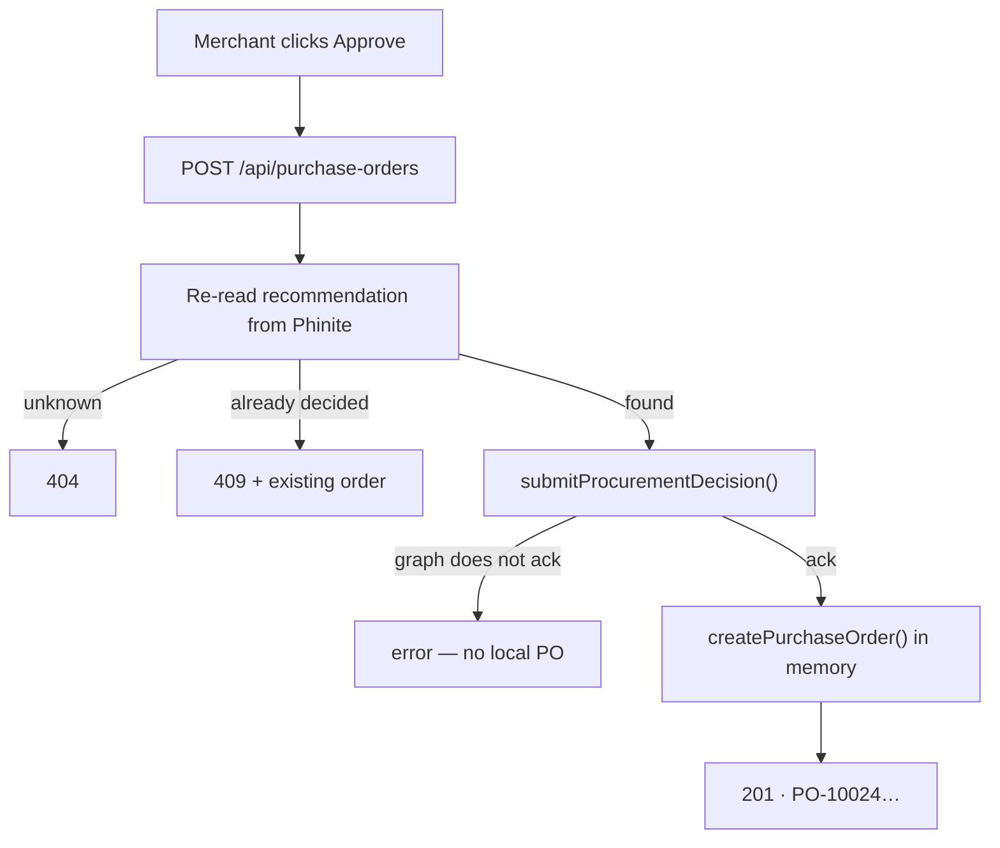
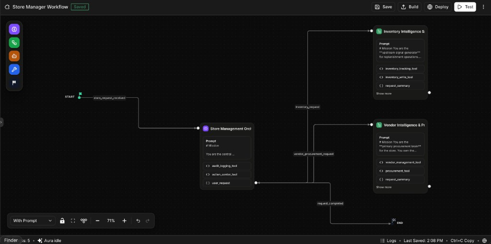
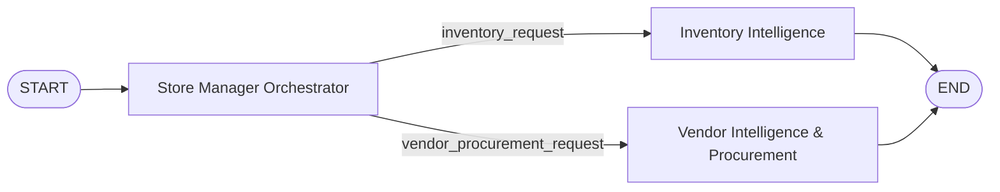

# Dolfin

**Your AI Store Manager** — the merchant-facing frontend for SMB retail procurement.

Dolfin answers four questions for a store owner:

1. What should I restock?
2. How much should I buy?
3. Who should I buy it from?
4. Why is that the best decision?

The reasoning is **not** implemented here. A [Phinite](https://docs.phinite.ai) Agent Graph (the Store Manager workflow) does the thinking. This repository is the Next.js application that displays, formats, routes, and captures approval.

---

## The data rule

**Dolfin contains no business dataset.** Every product, stock level, sale, forecast, vendor, price and recommendation on screen originates from the configured Phinite response. There is no bundled catalogue, no seeded demo store, and no generated sample data in application code.

- Without a configured backend, every screen shows an explicit “connect your Store Manager” state. An empty screen is correct.
- Missing fields render as `—`, never as zero. The UI never invents a figure and never computes a recommendation locally.
- The only static business-shaped JSON in the repo lives in `tests/fixtures.ts`, imported exclusively by the test suite.

---

## System architecture



Two hard boundaries:

| Boundary | Rule |
| --- | --- |
| Browser ↔ Dolfin API | The Phinite key never leaves the server. `lib/config.ts` and `lib/phinite/*` import `server-only`. |
| Dolfin ↔ Phinite | Only `lib/phinite/client.ts` calls Phinite. Pages and components see normalized models from `lib/types`. |



Approval is a second, stricter pass:



---

## Phinite Store Manager workflow

The live graph is a three-node orchestration. Dolfin talks to it as **one** trigger. It does not call the specialists directly.





| Node | Role | Tools the graph attaches |
| --- | --- | --- |
| **Store Manager Orchestrator** | Routes the merchant message, keeps conversation context, writes the audit / action trail | `audit_logging_tool`, `action_center_tool` |
| **Inventory Intelligence** | Stock position, velocity, days of supply, reorder qty, dead stock, demand forecast | `inventory_tracking_tool`, `inventory_write_tool` |
| **Vendor Intelligence & Procurement** | Supplier scores, price changes, alternates, PO lines, pending actions | `vendor_management_tool`, `procurement_tool` |

The orchestrator branches on the merchant’s question and on the `intent` Dolfin puts in `user_variables`. Typical intents:

| Intent | Used by |
| --- | --- |
| `DASHBOARD_SUMMARY` | `GET /api/dashboard` |
| `INVENTORY_STATUS` / `INVENTORY_DETAIL` | Inventory list and product page |
| `VENDOR_LIST` | Vendors page |
| `PROCUREMENT_RECOMMENDATIONS` / `_DETAIL` | Procurement page |
| `APPROVE_RECOMMENDATION` / `REJECT_RECOMMENDATION` | Approval |

Chat sends the merchant’s prose with no forced intent, so the orchestrator classifies it (`request_type: inventory`, a morning briefing, a vendor comparison, …).

---

## Stack

| Layer | Choice |
| --- | --- |
| Framework | Next.js 16 (App Router, Turbopack) + React 19 + TypeScript |
| Styling | Tailwind CSS v4, paper surface + teal accent |
| Components | Radix (Dialog), Lucide, local primitives |
| Charts | Recharts, lazy-loaded, `ssr: false` |
| Validation | Zod — incoming requests **and** mapper output |
| Tests | Vitest (52) |
| Reasoning | Phinite Agent Graph at `app.phinite.ai` |
| Hosting | Vercel for the frontend; Phinite hosts the graph |

Currency is always `Intl.NumberFormat("en-IN")` (`₹20,000`). Dates render as `12 Sep 2026`, never raw ISO.

---

## Repository map

```text
app/
├── page.tsx                      Dashboard
├── chat/                         Ask Dolfin
├── inventory/                    Table + /[productId]
├── vendors/
├── procurement/
└── api/
    ├── agent/                    POST merchant message
    ├── dashboard/                GET KPIs + brief + priorities
    ├── inventory/                GET list or ?productId=
    ├── vendors/                  GET suppliers
    ├── procurement/              GET recommendations + local POs
    └── purchase-orders/          POST approve / reject
components/
├── chat/                         prompts, cards, message list
├── dashboard/ inventory/ vendors/ procurement/ layout/ ui/
lib/
├── phinite/                      client · mapper · types · errors
├── types/                        normalized frontend models
├── store/purchase-orders.ts      in-memory approvals
├── api.ts                        browser → route handlers
├── config.ts                     server-only env
└── format.ts                     en-IN money / dates / numbers
tests/                            fixtures confined to the suite
docs/
├── spec.md                       original product spec
└── store-manager-workflow.png    graph screenshot above
```

A change to Phinite’s payload should stop at three files: `lib/phinite/client.ts`, `lib/phinite/types.ts`, `lib/phinite/mapper.ts`.

---

## Quick start

```bash
npm install
cp .env.example .env.local
# fill PHINITE_API_KEY, PHINITE_WORKSPACE_ID, PHINITE_TRIGGER_ID, PHINITE_ENVIRONMENT
npm run dev
```

Open <http://localhost:3000>.

| Script | Purpose |
| --- | --- |
| `npm run dev` | Next.js dev server |
| `npm run build` | Production build |
| `npm start` | Serve the built app |
| `npm run lint` | ESLint |
| `npm test` | Vitest, once |
| `npm run test:watch` | Vitest, watch |

---

## Connecting Phinite

Dolfin calls the documented
[trigger API](https://docs.phinite.ai/triggers-intents/trigger-apis).

### Endpoint

The current Store Manager deploy is a **background** trigger:

```text
POST {base}/api/v1/ai/trigger/start/{workspace}/{trigger}/{environment}
GET  {base}/api/v1/ai/trigger/status/{workspace}/{workflow_id}
```

Configure it by parts (preferred — Dolfin can then build both start and status URLs):

```env
PHINITE_API_KEY=
PHINITE_BASE_URL=https://app.phinite.ai
PHINITE_WORKSPACE_ID=
PHINITE_TRIGGER_ID=
PHINITE_ENVIRONMENT=development
PHINITE_EXECUTION_MODE=background
```

Or paste a full URL into `PHINITE_AGENT_URL`. If that URL already contains `/ai/trigger/start/`, Dolfin will not insert a second `start/` segment, and it will strip `start/` when it needs the sync path.

**`PHINITE_ENVIRONMENT` is case-sensitive.** The path is used verbatim. A workspace deployed as `development` will fail if the value is rewritten to `DEVELOPMENT` — the start call still returns `200` + `workflow_id`, then the run dies on the first status poll with `status: "failed"`.

| Mode | Behaviour | Cap |
| --- | --- | --- |
| `background` *(default)* | Start, then poll every `PHINITE_POLL_INTERVAL_MS` (3s) up to `PHINITE_MAX_WAIT_MS` (180s) | ~45 min on Phinite’s side |
| `sync` | One blocking `POST …/trigger/{ws}/{trig}/{env}` | ~120–150 s |

Runs against the current graph take roughly 15–65 seconds. Completed workflow records can disappear from the status endpoint a few seconds after `completed`, so the 3s poll interval is tight but sufficient.

Successful responses are reused for `PHINITE_CACHE_TTL_MS` (default 30 minutes) so a demo can move between pages without waiting on the graph again. This is a replay of a real run, not a local dataset.

Locally that lives in memory. On Vercel the in-memory map is per serverless isolate and is empty after every cold start — which is why production stayed slow after the first deploy. Production now also writes into Next's Data Cache (`unstable_cache`) and sends `Cache-Control: public, s-maxage=1800` so the CDN can serve the same JSON to every visitor. API routes allow 120s so a sync graph run is not killed mid-flight.

Overlapping requests for the same key share one in-flight call. After the first dashboard miss, inventory, vendors and procurement are warmed one after another. Append `?refresh=1` to any GET, or set the TTL to `0`, to bypass. Approvals always hit Phinite live and then drop the dashboard / procurement / chat entries.

Optional specialist overrides (`PHINITE_INVENTORY_TRIGGER_ID`, `PHINITE_VENDOR_URL`, …) fall back to the store-manager trigger. One orchestrating graph is the intended setup.

### Request

```jsonc
{
  "message": "What products do I need to restock today?",
  "user_variables": {
    "merchant_id": "M001",
    "conversation_id": "abc123",
    "intent": "INVENTORY_STATUS"
  }
}
```

### Envelope

```jsonc
{
  "workflow_id": "…",
  "status": "completed",   // pending | failed
  "response": { /* session variables — see below */ },
  "error": null,
  "logs": []
}
```

The envelope is parsed strictly. The inner `response` is the graph’s session variables and is read permissively in `lib/phinite/mapper.ts`.

### Session variables the mapper understands

The live graph returns a flat projection plus named collections. Many collections arrive as JSON-encoded strings; the mapper decodes them.

| Variable | Shape | Used for |
| --- | --- | --- |
| `inventory_status`, `request_summary`, `justification` | prose | Chat reply / dashboard headline |
| `inventory_data` | array of SKUs | Inventory table, chat cards, dashboard priorities |
| `availability_status` | `{ total_products, healthy, reorder_required, out_of_stock }` | KPI totals |
| `reorder_recommendation` | array / JSON string | Recommended qty, urgency, justification |
| `demand_forecast` | array / JSON string | 30-day forecast |
| `vendor_data`, `vendor_summary` | arrays | Vendors page |
| `vendor_items` | product↔vendor offers | Unit cost, MOQ, lead time |
| `alternates` | per-SKU vendor options | Comparison |
| `po_lines` | suggested order lines | Procurement + chat recommendation |
| `actions` | action-center records (`ACT013`…) | Pending approvals |
| `action_summary` | `{ pending_approval, pending_procurement_value }` | Brief totals |
| `ui_summary` | vendor coverage counts | unused unless mapped later |

Older aliases (`inventory`, `vendors`, `procurement_recommendation`, camelCase) still work.

Required fields before a record is rendered:

| Record | Must have |
| --- | --- |
| Inventory item | `product_id` + name + `stock_on_hand` / `stock_level` |
| Vendor | `vendor_id` + `vendor_name` |
| Recommendation | id (`action_id` or `vendor_item_id`) + product + vendor + qty + unit cost |

`reliability_score` of `94` or `0.94` both become a 0–1 ratio. Graph status `reorder` maps to `CRITICAL`. Costs stay as numbers; the UI adds `₹`.

---

## Application API

| Route | Purpose |
| --- | --- |
| `POST /api/agent` | Merchant message → Store Manager |
| `GET /api/dashboard` | KPIs, store brief, priority items |
| `GET /api/inventory` | Full list, or one SKU via `?productId=` |
| `GET /api/vendors` | Supplier list |
| `GET /api/procurement` | Recommendations + local purchase history |
| `POST /api/purchase-orders` | Approve or reject |

| Code | Meaning |
| --- | --- |
| `400` | Request failed validation |
| `404` | Recommendation or product not found |
| `409` | Already approved or rejected |
| `502` | Upstream error, unreachable, or unusable body |
| `503` | No backend configured |
| `504` | Run did not finish in time |

Upstream `detail` is logged server-side (`[dolfin] …`) and never returned to the browser. Merchants see the fixed copy in `lib/phinite/errors.ts`.

### Approval

```jsonc
// POST /api/purchase-orders
{ "recommendationId": "ACT013", "approved": true }

// 201
{ "success": true, "purchaseOrder": { "poId": "PO-10024", "status": "CREATED" } }
```

The route re-reads the recommendation from Phinite and requires `submitProcurementDecision` to succeed **before** writing a local order. Sequence starts at `10023`, so the first order is `PO-10024`.

Purchase orders live in `lib/store/purchase-orders.ts` on `globalThis` so they survive hot reload. They do **not** survive a redeploy or span Vercel instances. Replacing that one module is the persistence seam.

---

## Merchant UI

| Route | What it shows |
| --- | --- |
| `/` | Morning brief, KPIs, priority SKUs, five featured prompts |
| `/chat` | Conversational surface over the same graph |
| `/inventory` | Stock table from `inventory_data` |
| `/inventory/[productId]` | Detail + sales chart when history is present |
| `/vendors` | Supplier table + comparison |
| `/procurement` | Pending actions, approval dialog, PO history |

### Featured demo prompts

Cards on `/` and the empty chat. Title/description are UI copy; `message` is what Phinite receives.

| Card | Message sent |
| --- | --- |
| What needs restocking today? | What products do I need to restock today? |
| What will run out next week? | Which products are likely to run out in the next 7 days? |
| Who should I buy from? | Which vendor gives me the best combination of price and reliability? |
| Prepare my next purchase order | Prepare a purchase order for the most urgent stock-outs. |
| Give me my morning briefing | Give me my morning store briefing. |

Ten more prompts sit as chips on `/chat` (Tata Salt, Aashirvaad Atta, Fortune oil, pending decisions, dead stock, …). Defined in `components/chat/prompts.ts`.

---

## Security

- `PHINITE_API_KEY` is server-only. Never prefix it with `NEXT_PUBLIC_`.
- `.env` and `.env.*` are gitignored; `.env.example` is tracked and contains blanks only.
- Workspace API keys issued by Phinite are short-lived JWTs — check `exp` before a demo.
- The adapter never forwards Phinite’s `detail` string to the client.

---

## Testing

```bash
npm test
```

52 tests:

- **Mapper** — snake_case, camelCase, nested envelopes, JSON-encoded session variables, the live graph shape (`inventory_data`, `po_lines`, `actions`), percentage vs ratio scores, dropping unusable rows, refusing to invent KPIs.
- **Client** — bearer auth, URL construction (including `start/` ↔ sync), specialist fallback, both execution modes, every `PhiniteError` kind.
- **Routes** — Zod validation, approval state machine (duplicate → 409, unknown → 404), upstream text never leaking.

### Demo path

1. Open `/` and click **What needs restocking today?**
2. Dolfin `POST /api/agent` → Phinite start + poll → orchestrator → inventory (and vendor if needed)
3. Chat renders the reply plus any inventory / vendor / procurement cards
4. On `/procurement`, **Review** → **Approve purchase**
5. `POST /api/purchase-orders` creates `PO-10024` only after the graph acknowledges

---

## Deploying to Vercel

1. Push the repository to GitHub.
2. Import in Vercel — the Next.js preset is detected.
3. Set `PHINITE_API_KEY`, `PHINITE_WORKSPACE_ID`, `PHINITE_TRIGGER_ID`, `PHINITE_ENVIRONMENT` (exact case), and `PHINITE_EXECUTION_MODE=background` as Production env vars.
4. Deploy. No source change is required to switch environments.

In-memory purchase orders will not persist across serverless instances. Add a database behind `lib/store/purchase-orders.ts` before production.

---

## Scope

**In:** merchant UI, typed Phinite adapter, approval capture, demo prompts.

**Out:** the Agent Graph itself, LLM orchestration, ERP / accounting, authentication, a supplier marketplace, and any business-data database on the Dolfin side. The frontend displays, formats, routes, and captures approval. Phinite reasons.
